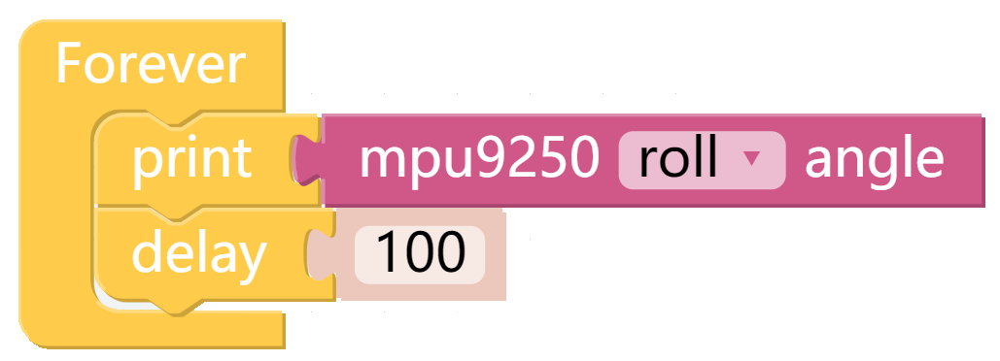
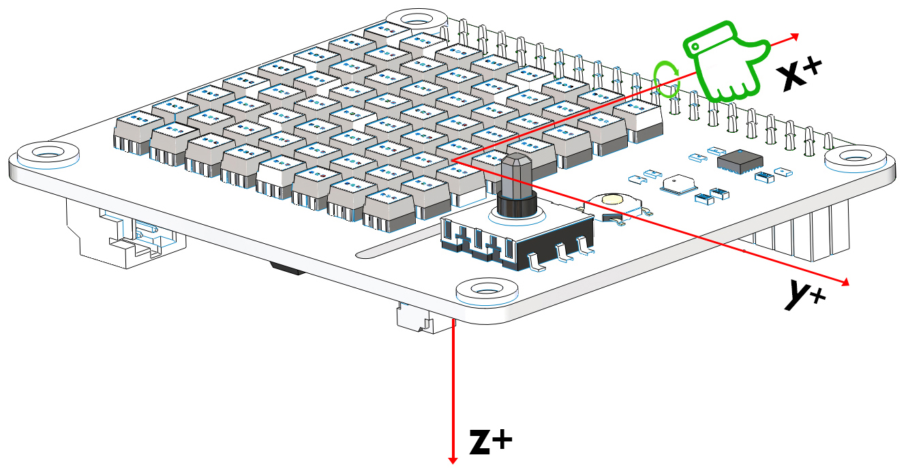

Attitude Angle
===============

X Sense HAT能计算当前位置的姿态角，这样我们就能判断X Sense HAT的平衡状态。

TIPS
------

你可以通过此块读取X Sense HAT的姿态角，修改下拉菜单选项，然后选择读取roll角或者pitch角。

EXAMPLE
---------

使用帮助
---------

这是适用于计算姿态角的坐标系，注意不同轴的正半轴的方向，这对我们判断旋转角度的方向会有帮助。

.. image:: img/tip56.jpg
  :width: 400
  :align: center

姿态角单位符号的判定同样遵循右手螺旋定则，将右手握住x轴，
大拇指指向x轴正半轴的方向，此时四根手指指向的方向就是roll角的正方向。
同理我们用右手握住y轴，将大拇指指向y轴正半轴的方向，此时四根手指指向的方向就是pitch角的正方向。

下载当前代码，水平放置时，打印窗口显示0。
我们将X Sense HAT沿着x轴顺时针旋转30度，此时打印窗口将显示30。

.. image:: img/tip70.jpg
  :width: 400
  :align: center

修改代码内容，然后重新下载。

.. image:: img/tip74.png
  :width: 550
  :align: center

水平放置时，打印窗口仍然显示0。我们将X Sense HAT沿着y逆时针旋转30度，此时打印窗口将显示-30。

.. image:: img/tip69.jpg
  :width: 400
  :align: center

