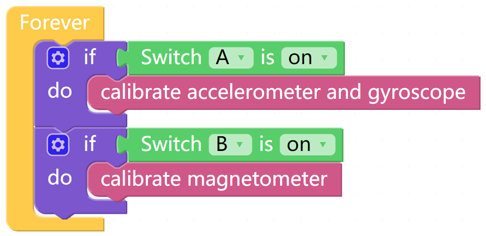

Calibrate the MPU9250
======================

The InvenSense MPU-9250 is a System in Package (SiP) that combines two chips: the
MPU-6500 three-axis accelerometer and three-axis gyroscope; and the AK8963 three-
axis magnetometer.在使用MPU9250模块之前，我们需要对不同的芯片进行校准。

TIPS
-----

Here we drag a Switch from the Bluetooth control page to 开启mpu9250模块的校准。

这个块读取开关的开合状态。

这个块用来开启 gyroscope 和 accelerometer 的校准。

这个块用来开启 magnetometer 的校准。

EXAMPLE
----------
  

MPU9250的坐标图
----------------

下图是MPU9250模块映射到X Sense HAT上的x轴，y轴和z轴,在校准MPU9250模块时，我们需要用到这个坐标图。

.. image:: img/tip34.jpg
  :width: 400
  :align: center

校准 accelerometer and gyroscope
----------------------------------

下载这份代码，将X Sense HAT放在水平桌面上，打开A开关，2秒后关闭A开关，校准完成。
X Sense HAT会将当前的水平位置记录为accelerometer和gyroscope的不同轴上的0度值点。

校准 magnetometer
------------------

关闭A开关，打开B开关(不运行同时打开两个开关进行MP9250模块校准)。将X Sense HAT沿着y轴顺时针旋转720°，
再沿着y轴逆时针旋转720°。这个过程大概需要用时15S以上，请控制好转速。

.. image:: img/tip35.jpg
  :width: 400
  :align: center

然后将X Sense HAT沿着x轴顺时针旋转720°，再沿着x轴逆时针旋转720°。
这个过程同样需要用时15S以上，请控制转速。

.. image:: img/tip36.jpg
  :width: 400
  :align: center

最后将X Sense HAT沿着z轴顺时针旋转720°，再沿着z轴逆时针旋转720°。关闭开关B，完成校准。
这个过程需要用时15S以上，请控制转速。

.. image:: img/tip37.jpg
  :width: 400
  :align: center

