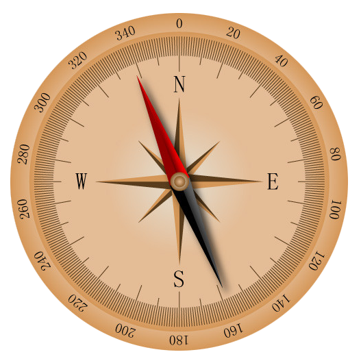

Compass
==========

We make X Sense HAT into a compass. Draw a circle on the RGB dot matrix, and then use the green dot to indicate the current direction, and the red dot to indicate the true north direction.

TIPS
-----

This block reads the current compass direction, and you can select the Azimuth bearing or Quadrant bearing by modifying the drop-down options.

You can use List block to simplify your program. Here we have created a list to record the coordinates of each point on the circle.

Get or remove the elements in the list.

* First Parameter: Select different lists
* Second Parameter: get or remove the elements in the list.
* Third Parameter: Elements at different positions in the list.

Use this block to take the remainder of the result of the division formula.

EXAMPLE
---------

.. note::
  You can find the full code on the Examples page of Ezblock Studio.

The green arrow indicates the detect direction of X Sense HAT, you can use it to judge the current position.

.. image:: img/tip71.png
  :width: 400
  :align: center

Azimuth Bearing
-----------------

Azimuth Bearing refers to the number on the outer circle and the Azimuth is the angle from the north direction line to the target direction line in a clockwise direction.
For example, 0 degrees is the direction of true north, and 30 degrees is the direction of 30° east by north.

Quadrant Bearing
-------------------

Quadrant Bearing divides the direction of the compass into eight equal parts. For example, the NE direction is between 22.5 degrees and 67.5 degrees.
And between 67.5 degrees and 112.5 degrees is the E direction.

.. image:: img/tip68.jpg
  :width: 530
  :align: center

