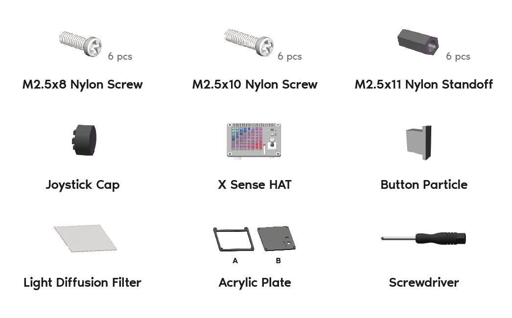
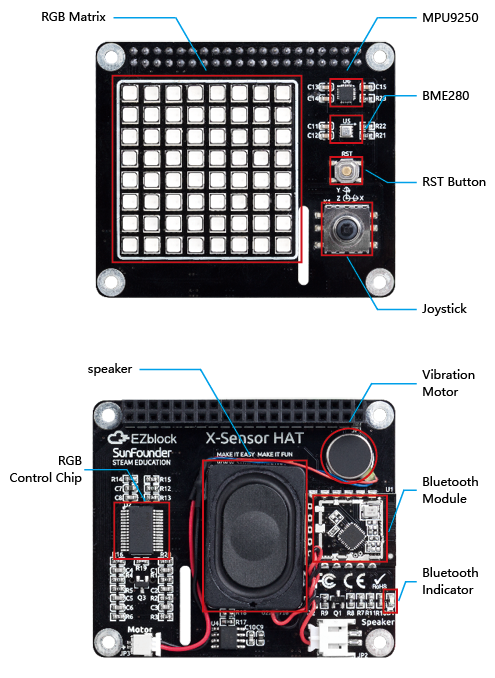

Components List
================

About X Sense HAT
-------------------

**RST Button:**

- Short pressing RST Button causes program resetting.
- Long press RST Button, you will disconnect the Bluetooth.

**Bluetooth Indicator:**

- The Bluetooth indicator keeps turning on at a well Bluetooth connection, blink at a Bluetooth disconnection, 
  blink fast at a signal transmission.

**MPU9250**

- MPU9250是一款集成了9 轴加速计+陀螺仪+磁力仪的MotionTracking 器件，如果你想要了解更多关于它的信息，
  请查看MPU9250的 `datesheet <https://invensense.tdk.com/wp-content/uploads/2015/02/PS-MPU-9250A-01-v1.1.pdf>`_
  。

**BME280**

- BME280是一款可以检测周围temperature, humidity and pressure的电子器件，如果你想要了解更多关于它的信息，
  请查看BME280的 `datesheet <https://www.mouser.com/datasheet/2/783/BST-BME280-DS002-1509607.pdf>`_
  。

**RGB Matrix**

- RGB Matrix由64个RGB led按照8x8网格组成，后面有一块RGB Control Chip控制每一个RGB led的颜色和亮度。

