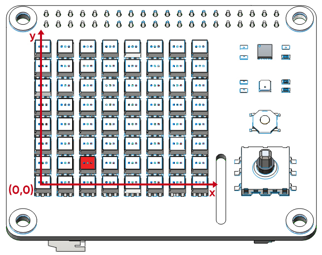
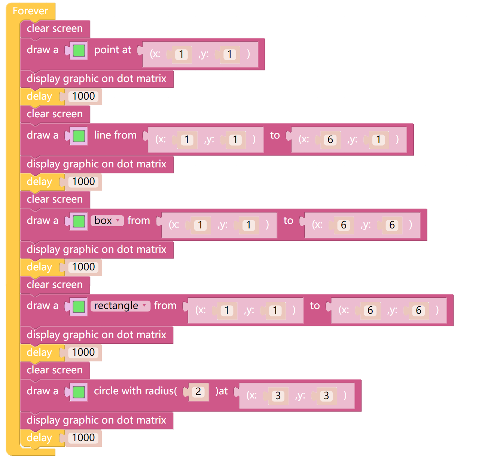

Point Line Rectangle Circle
=============================

通过在X Sense HAT上建立坐标系，我们可以在RGB点阵屏的指定位置上画一个点、一条直线、一个矩形和一个圆。

TIPS
-----

X Sense HAT的坐标系是以最左下角的RGB灯作为坐标原点（0,0）建立X轴和Y轴，
其中被点亮的红色RGB灯的坐标是（2,1）.

这个块可以清除 RGB 点阵屏上的内容。

通过这个块可以让画好的内容显示在RGB点阵屏上。

EXAMPLE
--------

