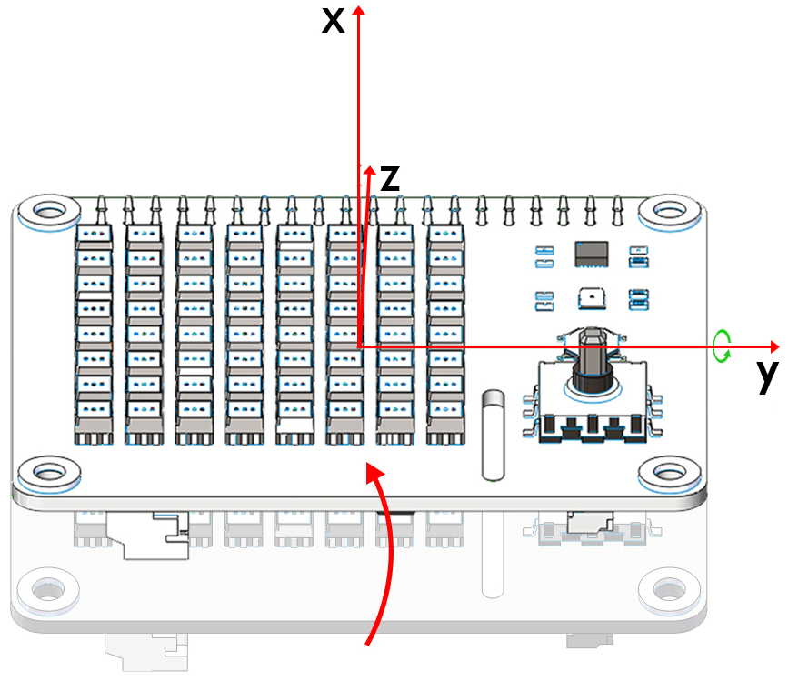
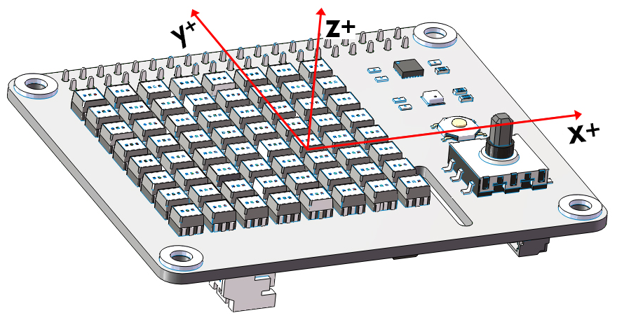
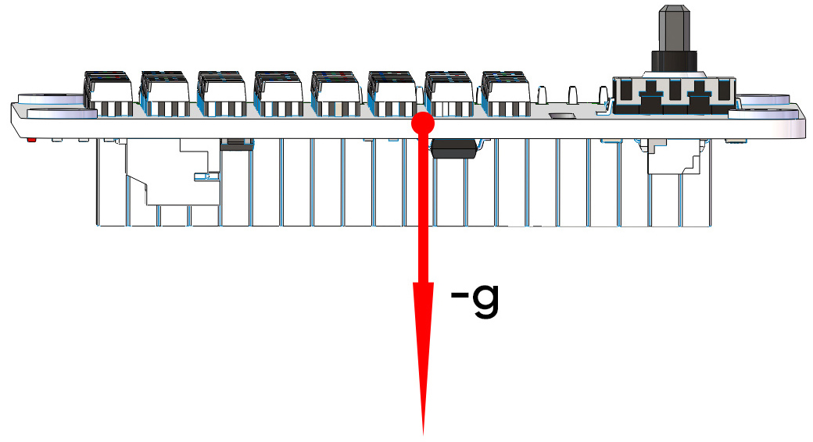
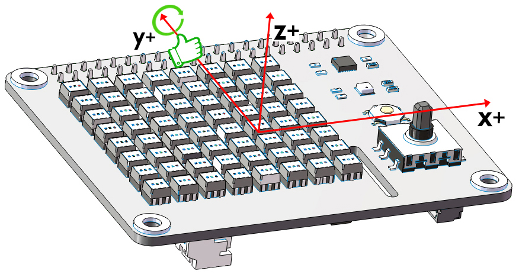
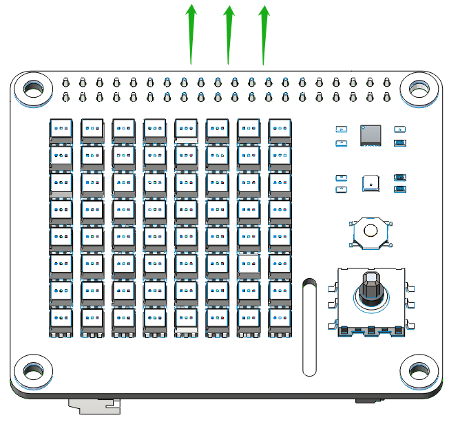
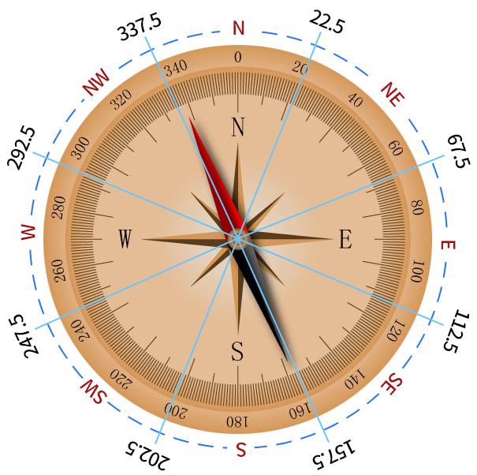
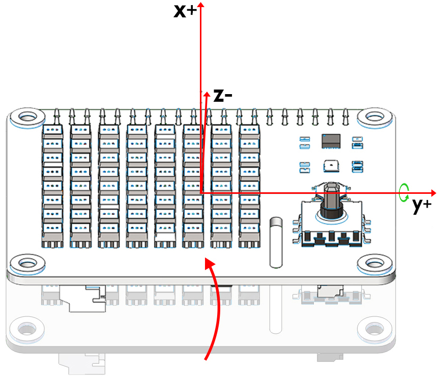

Python Programming
====================

Download the Code
-------------------

We can download the example codes by using git clone in the Raspberry Pi.

Change directory to /home/pi.

.. code-block:: python

    cd /home/pi/

NOTE: cd, short for change directory is to change from the current path to the 
intended directory. Informally, here is to go to the path /home/pi/.

Clone the repository from github.

.. code-block:: python

    git clone https://github.com/sunfounder/x-sense-hat

Stop Ezblock Service
-----------------------

The running of codes is based on Ezblock Studio. 
**Please stop Ezblock at first**
.

.. code-block:: python

    sudo service ezblock stop

If you want to restart Ezblock, please run:

.. code-block:: python

    sudo service ezblock start

Ezblock is a startup program, and you can select the different commands to decide
whether the program runs at startup or not:

.. code-block:: python

    sudo service ezblock-reset stop

.. code-block:: python

    sudo service ezblock-reset start

Python Code Control
----------------------

Input the command to open the example folder, and you will see there are 13 python
codes and a web_control folder in it.

.. code-block:: python

    cd /home/pi/x-sense-hat/examples

You can run the python codes by the following command:

.. code-block:: python

    sudo python3 1.Draw_a_Graphic.py 

1.Draw_a_Graphic.py
^^^^^^^^^^^^^^^^^^^^^^^

运行代码后，X Sense HAT的点阵屏上会显示一个有趣的小人物。

2.Test_the_Vibration_Motor.py
^^^^^^^^^^^^^^^^^^^^^^^^^^^^^^^^

运行代码后，X Sense HAT上的电机会振动得越来越快。

3.Display_Temperature.py
^^^^^^^^^^^^^^^^^^^^^^^^^^^^

将X Sense HAT制作成一个温度计，你可以在RGB点阵上查看温度值。

4.Sound_Effect.py
^^^^^^^^^^^^^^^^^^^^^

X Sense Hat can make voice. You can type text to make it speak, or make specific sound effects. 
Let us fire a gun as soon as a 3s countdown stops.

If you want to manually add some sound effects, you can upload your sound
effects to the path /home/pi/Sound/ via FTP. Steps are:

1) Download desired sound effects to your PC and then download a FileZilla
software.

2) Start FileZilla then enter Host: 192.168.18.152, Usename: pi, Password:
raspberry, Port: 22 and click Quickconnect. Copy the desired sound effects to 
/home/pi/Sound/.

3) Modify the function: sound_effect_play('Weapon_Continue_Shooting.wav',50)
the sound effect file in the 6.sound_effect.py.

.. image:: img/start9.png
  :width: 500
  :align: center

5.Music_Player.py
^^^^^^^^^^^^^^^^^^^^

In addition to having X Sense HAT play sound effects or speak on specific occasions, you
can also add background music to it. 使用摇杆的上下方向键来控制音量大小，左右方向键控制音乐的暂停和继续。

To add music, you can try to upload your music to the path /home/pi/Music/ via
FTP. Rename the music file in the function background_music('spry.mp3').

6.Point_Line_Rectangle_Circle.py
^^^^^^^^^^^^^^^^^^^^^^^^^^^^^^^^^^^

在X Sense HAT的RGB点阵屏上画一个点、一条直线、一个矩形和一个圆。

7.Calibrate_the_Accelerometer_and_Gyroscope.py
^^^^^^^^^^^^^^^^^^^^^^^^^^^^^^^^^^^^^^^^^^^^^^^^^

The InvenSense MPU-9250 is a System in Package (SiP) that combines two chips: the MPU-6500 three-axis 
accelerometer and three-axis gyroscope; and the AK8963 three-axis magnetometer.
首先我们对accelerometer and gyroscope进行校准。

下图是MPU9250模块映射到X Sense HAT上的x轴，y轴和z轴,在校准MPU9250模块时，我们需要用到这个坐标图。

.. image:: img/tip34.jpg
  :width: 400
  :align: center

下载这份代码，将X Sense HAT放在水平桌面上，等待2秒后，按 ``Ctrl`` + ``C`` 退出代码的运行，校准完成。
X Sense HAT会将当前的水平位置记录为accelerometer和gyroscope的不同轴上的0度值点。

8.Calibrate_the_Magnetometer.py
^^^^^^^^^^^^^^^^^^^^^^^^^^^^^^^^^^^^

下载这份代码，将X Sense HAT沿着y轴顺时针旋转720°，
再沿着y轴逆时针旋转720°。这个过程大概需要用时15S以上，请控制好转速。

.. image:: img/tip35.jpg
  :width: 400
  :align: center

然后将X Sense HAT沿着x轴顺时针旋转720°，再沿着x轴逆时针旋转720°。
这个过程同样需要用时15S以上，请控制转速。

最后将X Sense HAT沿着z轴顺时针旋转720°，再沿着z轴逆时针旋转720°，按 ``Ctrl`` + ``C`` 退出代码的运行，校准完成。
这个过程需要用时15S以上，请控制转速。

.. image:: img/tip37.jpg
  :width: 400
  :align: center

9.Read_from_MPU9250.py
^^^^^^^^^^^^^^^^^^^^^^^^^

校准完MPU9250模块之后，我们来打印MPU9250模块读取到的数据。

下图是accelerometer和gyroscope映射到X Sense HAT上的x轴，y轴和z轴,
在读取accelerometer和gyroscope在不同轴上的值时，我们都需要用到这个坐标图。

.. note::
  注意不同数轴的符号，如果在x轴的正半轴（x+）上有一个加速度值，那么它的单位为正。

通过accelerometer，我们可以读取X Sense HAT在不同坐标轴上的加速度值，单位大小为g。

将X Sense HAT水平放置，此时X Sense HAT会受到一个垂直向下的重力加速度，大小为g（g=9.80665 N/kg）。

当我们来打印accelerometer 在z轴上的加速度值时，打印窗口会显示一个-1左右的值
（由于加速度值在 z 负半轴，所以单位为负）。

.. code-block:: python

    def forever():
        print("%s"%(imu.read("accel","z")))
        delay(100)

将X Sense HAT绕着y轴顺时针旋转，此时X Sense HAT受到的重力加速度可以分解成一个x轴上的加速度和
一个z轴上的加速度，我们可以通过打印accelerometer在x轴上的值和accelerometer在z轴上的值来
分别获取X Sense HAT在x正半轴上加速度的值（X1）和在z负半轴上加速度的值（Z1）。

.. code-block:: python

    def forever():
        print("%s"%('-----------------'))
        print("%s"%(imu.read("accel","x")))
        print("%s"%(imu.read("accel","z")))
        delay(100)

通过gyroscope，我们可以读取X Sense HAT在不同坐标轴上的角速度值，单位大小为degrees/second，
单位符号的判断遵循右手螺旋定则，将右手握住数轴，大拇指指向数轴正半轴的方向，
此时四根手指指向的方向就是对应数轴的角速度值的正方向。

打印gyroscope在y轴上的角速度值。

.. code-block:: python

    def forever():
        print("%s"%(imu.read("gyro","y")))
        delay(100)

将X Sense HAT绕着y轴顺时针旋转，由于X Sense HAT的角度发生了变化，所以产生了y轴的角速度值。
同时打印窗口会显示y轴的角速度值，根据右手螺旋定则可以判断它的单位为正。

.. image:: img/tip44.jpg
  :width: 400
  :align: center
  
下图是magnetometer映射到X Sense HAT上的x轴，y轴和z轴,在读取magnetometer在不同轴上的值时，
我们都需要用到这个坐标图。
  
.. image:: img/tip56.jpg
  :width: 400
  :align: center

.. note::
  注意不同数轴的符号，如果在X轴的正半轴（x+）上有一个磁场强度值，那么它的单位为正。

通过magnetometer，我们可以读取X Sense HAT在不同坐标轴上的磁场强度，单位大小为15μT。

我们可以把一块磁铁放在X Sense HAT的X正半轴上。

.. image:: img/tip66.jpg
  :width: 400
  :align: center

然后打印X Sense HAT在x正半轴上磁场强度的值（单位为正）。

.. code-block:: python

    def forever():
        print("%s"%(imu.read("mag","x")))
        delay(100)

10.Know_the_Direction.py
^^^^^^^^^^^^^^^^^^^^^^^^^^

我们把X Sense HAT制作成一个指南针，这样我们就不会迷失方向了。

绿色箭头表示X Sense HAT检测的方向，你可以通过它来判断当前的位置。

azimuth是从某点的指北方向线起，依顺时针方向到目标方向线之间的水平夹角（指南针的外圈数值）。
根据得出的azimuth，我们就可以知道当前的位置，例如0度就是正北方向，30度就是北偏东30度角方向。

.. image:: img/tip47.png
  :width: 500
  :align: center

.. code-block:: python

  def forever():
    print("%s"%(imu.magnetic_angle('azimuth')))
    delay(100)

quadrant是将指南针的方向八等分，我们可以借助azimuth来划分这八个区域，例如22.5度-67.5度之间就是NE方向，
而67.5度-112.5之间就是E方向。

.. code-block:: python

  def forever():
    print("%s"%(imu.magnetic_angle('quadrant')))
    delay(100)

11.Attitude_Angle.py
^^^^^^^^^^^^^^^^^^^^^^^^

X Sense HAT能计算当前位置的姿态角，这样我们就能判断X Sense HAT的平衡状态。

这是适用于计算姿态角的坐标系，注意不同轴的正半轴的方向，这对我们判断旋转角度的方向会有帮助。

.. image:: img/tip56.jpg
  :width: 400
  :align: center

姿态角单位符号的判定同样遵循右手螺旋定则，将右手握住x轴，
大拇指指向x轴正半轴的方向，此时四根手指指向的方向就是roll角的正方向。
同理我们用右手握住y轴，将大拇指指向y轴正半轴的方向，此时四根手指指向的方向就是pitch角的正方向。

.. image:: img/tip57.jpg
  :width: 400
  :align: center

下载这份代码，水平放置时，Terminal窗口将显示0。
我们将X Sense HAT沿着x轴顺时针旋转30度，此时Terminal窗口将显示30。

.. image:: img/tip70.jpg
  :width: 400
  :align: center

然后将X Sense HAT沿着y逆时针旋转30度，此时Terminal窗口将显示-30。

12.Make_Gif.py
^^^^^^^^^^^^^^^^

将多幅图像数据存于一起，并逐帧显示到RGB点阵上，这么我们就能在X Sense HAT上做一个简单的Gif动画。

13.Spirit_Level.py
^^^^^^^^^^^^^^^^^^^^

将X Sense HAT做成一个水平仪。通过读取roll角和pitch角的变化，我们可以判断X Sense HAT当前是否位于水平状态。

14.Gravity_Ball_Game.py
^^^^^^^^^^^^^^^^^^^^^^^^^^

接下来我们在X Sense HAT上制作一个重力小球的游戏。按下摇杆后，游戏开始。如果RGB点阵屏上的小球碰到边缘，则游戏结束。

15.Compass.py
^^^^^^^^^^^^^^^

我们将X Sense HAT制作成一个指南针，在RGB点阵上画一个圆，然后用绿点表示当前方向，红点表示正北方向。

16.Smart_Sensor_Hat.py
^^^^^^^^^^^^^^^^^^^^^^^^

我们把X Sense HAT的功能集成到一个菜单界面里，按住摇杆的方向键选择功能选项，按下摇杆则执行当前功能选项。

17.bugs_jump.py
^^^^^^^^^^^^^^^^^^

这是一个跳跃障碍物游戏，通过摇杆的上控制虫子的跳跃动作来躲避会变速障碍物

18.gluttonous_snake.py
^^^^^^^^^^^^^^^^^^^^^^^^^

这是一个通过摇杆进行的贪吃蛇游戏，规则是20秒内尽可能多的吃绿色点，吃到自己的身体，分会归零

19.gravity_ball.py
^^^^^^^^^^^^^^^^^^^^^^

这是一个靠重力感应去控制方块吃点的游戏，触碰边界会一直扣分，规定时间内，吃的点越多，分数越高

20.pattern.py
^^^^^^^^^^^^^^^^

运行代码后，RGB点阵屏上会显示一个有趣的图案。

