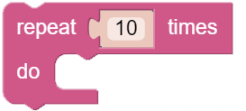
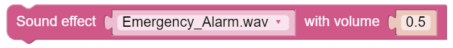
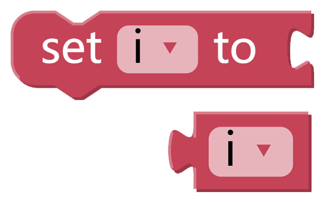
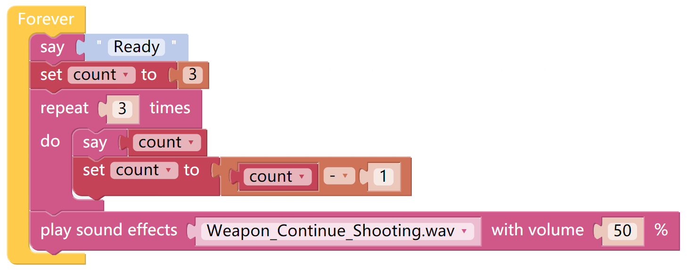

Sound Effect
==============

X Sense HAT can make voice. You can enter text to make it speak, or make specific sound effects. 
Let us fire a gun as soon as a 3s countdown stops.

TIPS
------

Write the sentence in this block, and X Sense HAT will say it. It can be used with Text.

A number block.

You may want to use repeat which can help you repeatedly execute the same 
statement and reduce code size.

Mathematical operation block can perform " + , - , x , ÷ ".

This block can emit some preset sound effects, such as siren sound, gun sound and so on. The range of volume is 1~100.

You may want to simplify your program with Variable. For example, when you have multiple functions that need to read the obstacle distance, you don't need to read the value for each function, just load the value into a variable and use it multiple times.

Click the Create variable button on the Variables category to create a variable named distance.

EXAMPLE
---------

