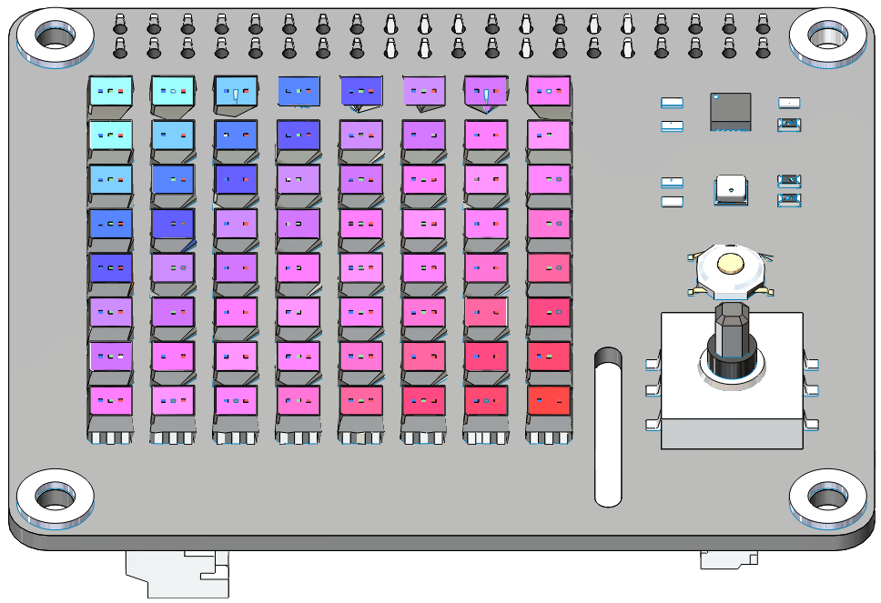
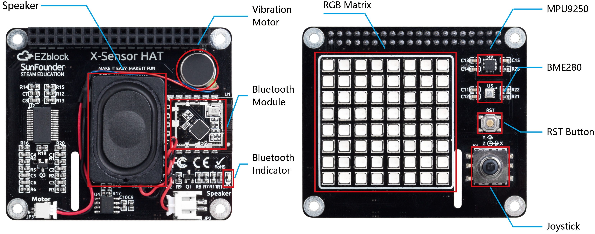

About X Sense HAT
====================

The X Sense HAT is an add-on board for Raspberry Pi. It includes an 8×8 RGB LED matrix, a joystick，a BME280 sensor and a MPU9250 sensor. At the same time it also equipped with a speaker and a vibration motor, you can use them to make your X Sense HAT more interesting.

It contains the following functions：

* Draw a pixmap and gif
* Detect Temperature
* Detect Humidity
* Detect Pressure
* Detect Acceleration
* Detect Angular velocity
* Detect Geomagnetic Direction
* Detect Attitude Angle
* TTS
* Play Sound Effects
* Play Backgrounds
* Feel the Vibration

**RST Button:**

- Short pressing RST Button causes program resetting.
- Long press RST Button, you will disconnect the Bluetooth.

**Bluetooth Indicator:**

The Bluetooth indicator keeps turning on at a well Bluetooth connection, blink at a Bluetooth disconnection, blink fast at a signal transmission.

**MPU9250**

MPU-9250 is a 9-axis MotionTracking device that combines a 3-axis gyroscope, 3-axis accelerometer, 3-axis magnetometer and a Digital Motion Processor™ (DMP) all in a small 3x3x1mm package available as a pin-compatible upgrade from the MPU6515. 
If you want to know more about it, please check the `MPU9250 Datasheet <https://invensense.tdk.com/wp-content/uploads/2015/02/PS-MPU-9250A-01-v1.1.pdf>`_.

**BME280**

BME280 is an environmental sensor that integrates temperature, humidity, air pressure and trinity. With high-level, multi-function, small size, etc.
If you want to know more about it, please check the `BME280 Datasheet <https://www.mouser.com/datasheet/2/783/BST-BME280-DS002-1509607.pdf>`_.

