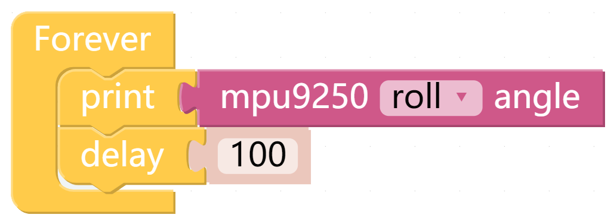
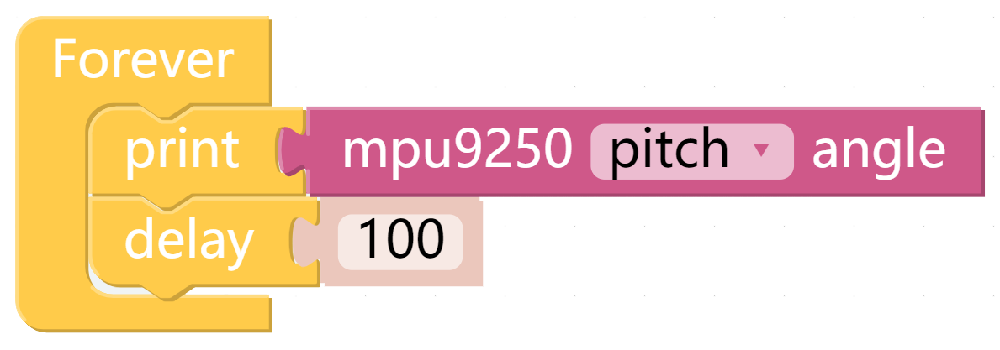

Attitude Angle
===============

The X Sense HAT calculates the attitude angle of the current position so that we can know whether the X Sense HAT horizontal or not.

TIPS
------

You can read the attitude angle of X Sense HAT through this block, modify the drop-down menu options, and then choose to read roll angle or pitch angle.

EXAMPLE
---------

Using help
------------

This is the coordinate system of the attitude angle.

.. image:: img/tip56.jpg
  :width: 600
  :align: center
.. note::

  Note the positive direction on each axis.

The unit symbol of the attitude angle also follows the right-hand spiral rule. 

Hold the **x-axis** with your right hand and the thumb points in the direction of the positive semi-axis.
At this time, the direction pointed by the four fingers is the positive direction of the roll angle.

In the same way, hold the **y-axis** with your right hand and the thumb points in the direction of the positive semi-axis.
At this time, the direction pointed by the four fingers is the positive direction of the **pitch angle**.

.. image:: img/tip57.jpg
  :width: 600
  :align: center

After the code runs, and then place the X Sense HAT horizontally, 0 will be printed on the Debug Monitor.

If you rotate the X Sense HAT 30 degrees clockwise around the **x-axis**, 30 will be printed on the Debug Monitor.

.. image:: img/tip70.jpg
  :width: 400
  :align: center

Now change the drop-down menu to **pitch**, and then re-run the code.

Rotate the X Sense HAT 30 degrees counterclockwise around the **y-axis**, -30 will be printed on the Debug Monitor.

.. image:: img/tip69.jpg
  :width: 400
  :align: center

