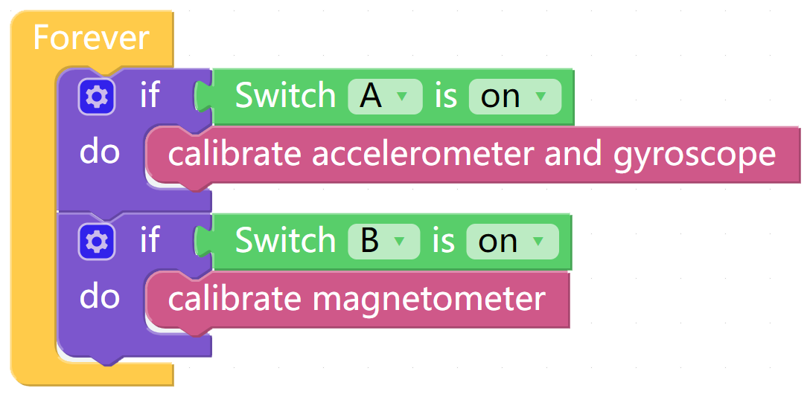
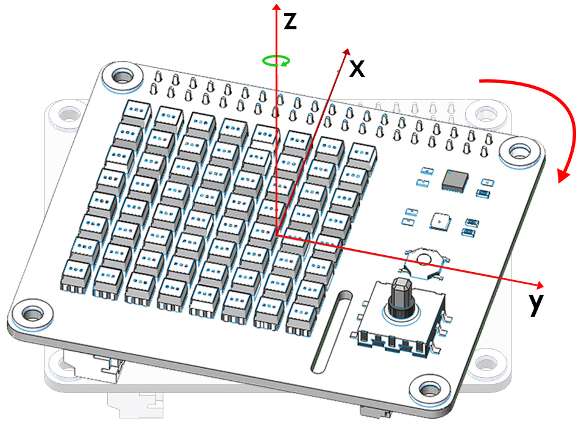

Calibrate the MPU9250
=======================

The InvenSense MPU9250 is a System in Package (SiP) that combines two chips: the MPU-6500 three-axis Accelerometer and three-axis Gyroscope; and the AK8963 three-axis Magnetometer. 

Before using the MPU9250 chip, we need to calibrate different chips.

TIPS
-----

Here we drag a **Switch** from the Bluetooth Control page to start the Mpu9250 calibration.

The block reads the status of the **Switch**.

This block is used to calibrate Gyroscope and Accelerometer.

Use the following block to calibrate the Magnetometer.

EXAMPLE
----------
  

Calibrate Accelerometer and Gyroscope
----------------------------------------

After running the code, place the X Sense HAT horizontally, turn the A switch on and turn it off after 2 seconds, then the calibration is complete.

The X Sense HAT records the current horizontal position as a 0 degree point on the different axes of the Accelerometer and Gyroscope.

Once calibration is complete, press the Joystick on the X Sense HAT to confirm.

Calibrate Magnetometer
-----------------------

The figure below is the coordinate system that will be used to calibrate the magnetometer.

.. image:: img/tip34.jpg
  :width: 400
  :align: center

Turn the B switch on（keep switch A off）, rotate the X Sense HAT clockwise around the **y-axis** by 720° and then rotate it back (also 720°), please control the speed so that the process takes about 15s.

.. image:: img/tip35.jpg
  :width: 400
  :align: center

Similarly, rotate the X Sense HAT clockwise around the **x-axis** by 720° and then rotate it back (also 720°), please control the speed so that the process takes about 15s.

.. image:: img/tip36.jpg
  :width: 400
  :align: center

Finally, rotate the X Sense HAT clockwise around the **z-axis** by 720° and then rotate it back (also 720°), please control the speed so that the process takes about 15s.

Turn off switch B to complete the calibration.

Once calibration is complete, press the Joystick on the X Sense HAT to confirm.