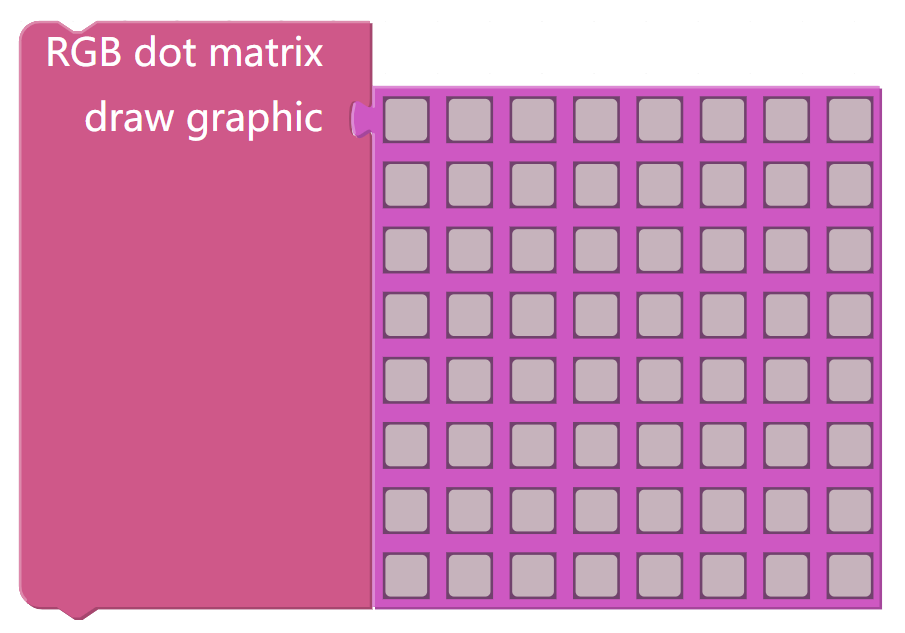
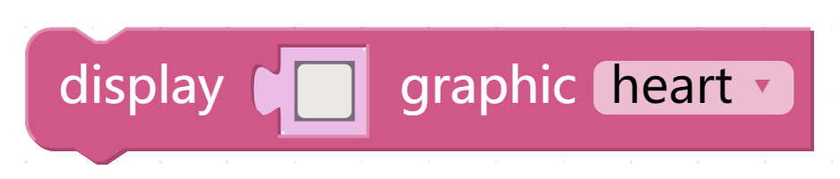
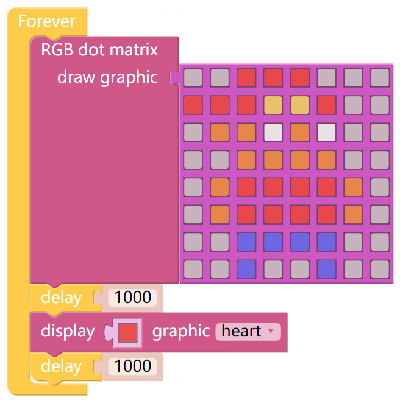

Display Graphics
=================

Firstly, we need to know how to simply use the RGB dot matrix screen. Here we will draw a funny character and show a heart on the screen.

TIPS
------

You can draw a graphic on this block and display it on X Sense HAT.

This block is used to display different graphics and customise their colours.

* The first parameter is used to modify the colour, clicking on it will bring up a colour matrix where you can choose the colour you like.
* The graphic is selected by clicking on the drop-down box of the second parameter.

Select the colour for the RGB matrix screen.

  .. image:: img/tip2.png
    :width: 150
    :align: center

EXAMPLE
---------

