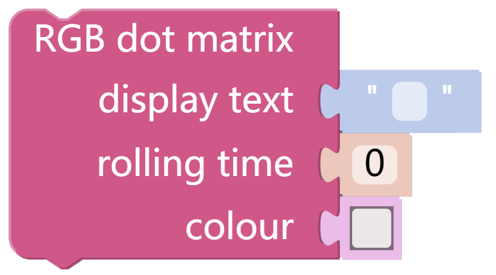
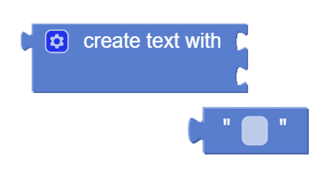
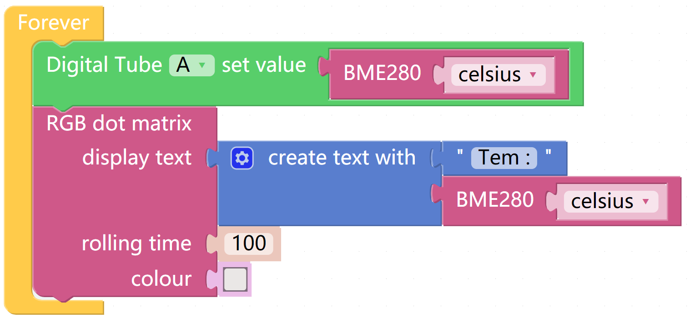

Display Temperature
=====================

At this time the X Sense HAT is a thermometer to display the current temperature. You can also check the current temperature remotely on your device.

TIPS
-----

This block is used to read the results detected by the BME280 and you can choose to read temperature (Celsius and Fahrenheit) or pressure or humidity via the drop down menu options.

You can use this block to display the scrolling text on the X Sense HAT.

* First Parameter: The text you want to display.
* Second Parameter：The speed of the text scrolling (in seconds/column).
* Third Parameter: The text colour, can be modified by clicking on it.

Here we drag a digital tube from the Bluetooth Control page to display the temperature value.

This block displays the entered parameters on the Digital Tube.

you may want to use text block to print the combination of texts & data at once.

EXAMPLE
---------

