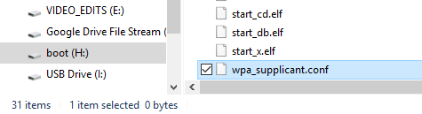
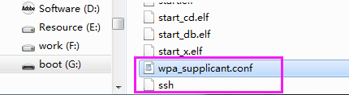
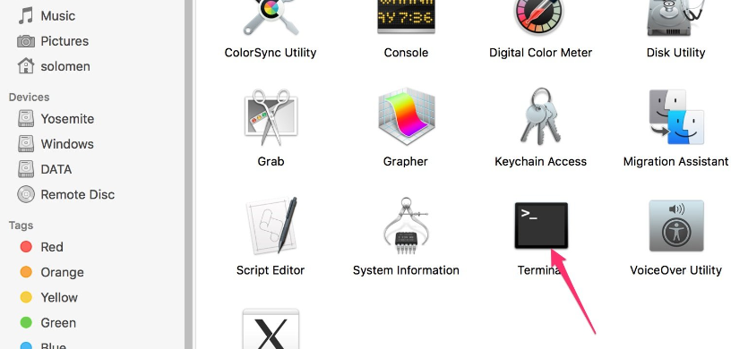
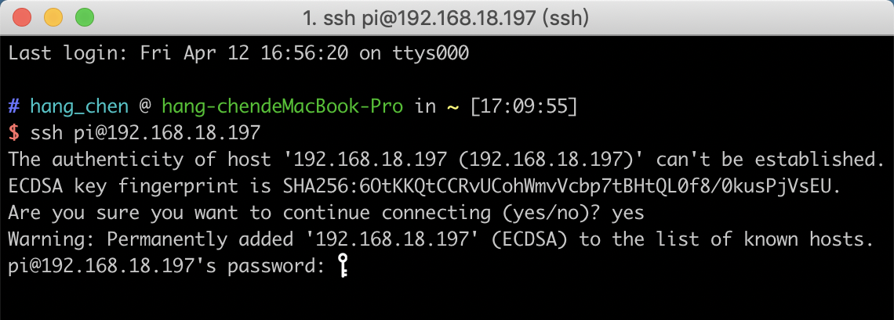
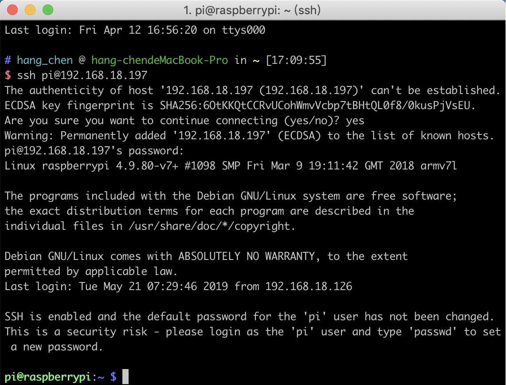
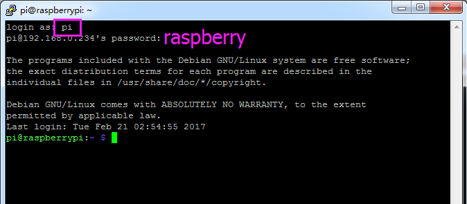
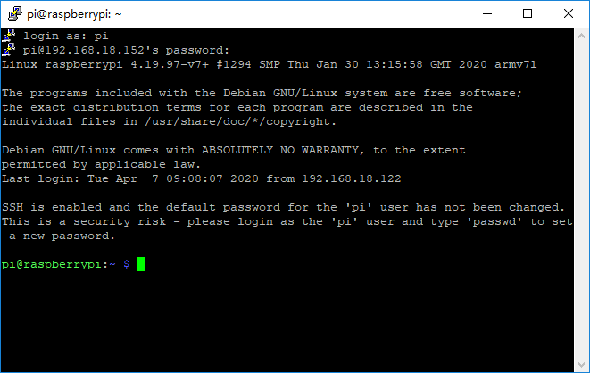

Get Started With Raspberry Pi
================================

Connect the Raspberry Pi to the Internet
-------------------------------------------

You need to modify a Wi-Fi configuration file wpa_supplicant.conf in the Micro SD
card by your PC that is located in the directory /etc/wpa_supplicant/.

If your personal computer is working on a linux system, you can access the directory 
directly to modify the configuration file; however, if your PC use Windows system,
then you can’t access the directory and what you need next is to go to the directory, 
/boot/ to create a new file with the same name, 
**wpa_supplicant.conf**
.

Input the following content in the file:

.. code-block:: python

  ctrl_interface=DIR=/var/run/wpa_supplicant GROUP=netdev
  update_config=1
  country=COUNTRY
  network={
  ssid="SSID"
  psk="PASSWORD"
  key_mgmt=WPA-PSK
  priority=1
  }

.. note::
  * COUNTRY should be set the two-letter ISO/IEC alpha2 code for the country in which you are using your Raspberry Pi, please refer to the following link:
  https://en.wikipedia.org/wiki/ISO_3166-1_alpha-2#Officially_assigned_code_elements

  * You need to replace “SSID” with your custom name of WiFi and “PASSWORD” with your password. By doing these, the Raspberry Pi OS will move this file to the target directory automatically to overwrite the original WIFI configuration file when it runs next time. 

Start SSH
---------------
To use the function of remote control of the Raspberry Pi, you need to start SSH firstly that is a more reliable protocol providing security for remote login sessions and other network services. Generally, SSH of Raspberry Pi is in a disabled state. Additionally, if you want to run it, you need to create a file named SSH under directory /boot/.

Now, the Ezblock system is configured. When the Micro SD card is inserted into the Raspberry Pi, you can use it immediately.

Get the IP Address
---------------------

After the Raspberry Pi is connected to Wi-Fi, we need to get the IP address of it. There
are many ways to know the IP address, and two of them are listed as follows.

Checking via Router
^^^^^^^^^^^^^^^^^^^^^^

If you have permission to log in the router (such as a home network), you can check
the addresses assigned to Raspberry Pi on the admin interface of router.

The default hostname of the system, Raspbian is raspberrypi, and you need to find it.
(If you are using ArchLinuxARM system, please find alarmpi.)

Network Segment Scanning
^^^^^^^^^^^^^^^^^^^^^^^^^^^

You can also use network scanning to look up the IP address of Raspberry Pi. You can
apply the software, 
**Advanced IP scanner**
and so on.

Scan the IP range set, and the name of all connected devices will be displayed. 
Similarly, the default hostname of the Raspbian system is raspberrypi, now you need to
find the hostname.

Remote Control
----------------

We can open the Bash Shell of Raspberry Pi by applying SSH. Bash is the standard default 
shell of Linux. The Shell itself is a program written in C that is the bridge linking
the customers and Unix/Linux. Moreover, it can help to complete most of the work
needed.

For Linux or/Mac OS X Users
^^^^^^^^^^^^^^^^^^^^^^^^^^^^^

1.Go to Applications->Utilities, find the Terminal, and open it.

2.Type in ssh pi@ip_address. “pi” is your username and “ip_address” is your IP ad-
dress. For example:

.. code-block:: python

    ssh pi@192.168.18.197

3.Input ”yes”.

.. image:: img/start3.png
  :width: 500
  :align: center

4.Input the passcode and the default password is “raspberry”.

.. note::
  When you input the password, the characters do not display on window accordingly, which is normal. What you need is to input the correct passcode.

5.We now get the Raspberry Pi connected and are ready to go to the next step.

For Windows Users
^^^^^^^^^^^^^^^^^^^

If you’re a Windows user, you can use SSH with the application of some software.
Here, we recommend PuTTY.

1.Download PuTTY.

2.Open PuTTY and click Session on the left tree-alike structure. Enter the IP address
of the RPi in the text box under Host Name (or IP address) and 22 under Port (by default it is 22). 
Click Open.

.. image:: img/start6.png
  :width: 400
  :align: center

.. note::
  When you first log in to the Raspberry Pi with the IP address, there prompts a security reminder. Just click Yes.

3.When the PuTTY window prompts “login as:”, type in “pi” (the user name of the
RPi), and password: “raspberry” (the default one, if you haven’t changed it).

.. note::
  When you input the password, the characters do not display on window accordingly, which is normal. What you need is to input the correct passcode.

4.Here, we get the Raspberry Pi connected and it is time to conduct the next steps.

