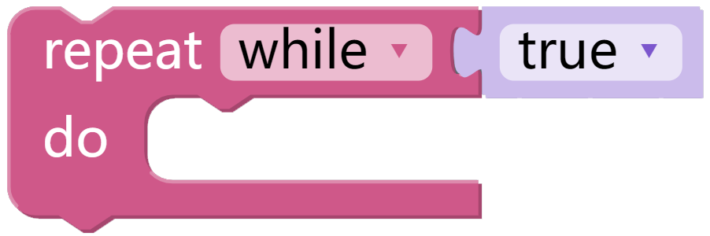
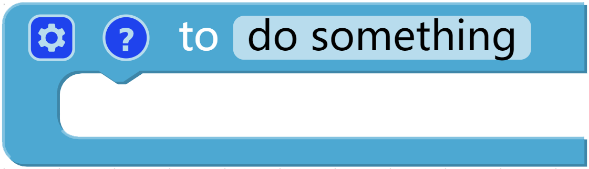
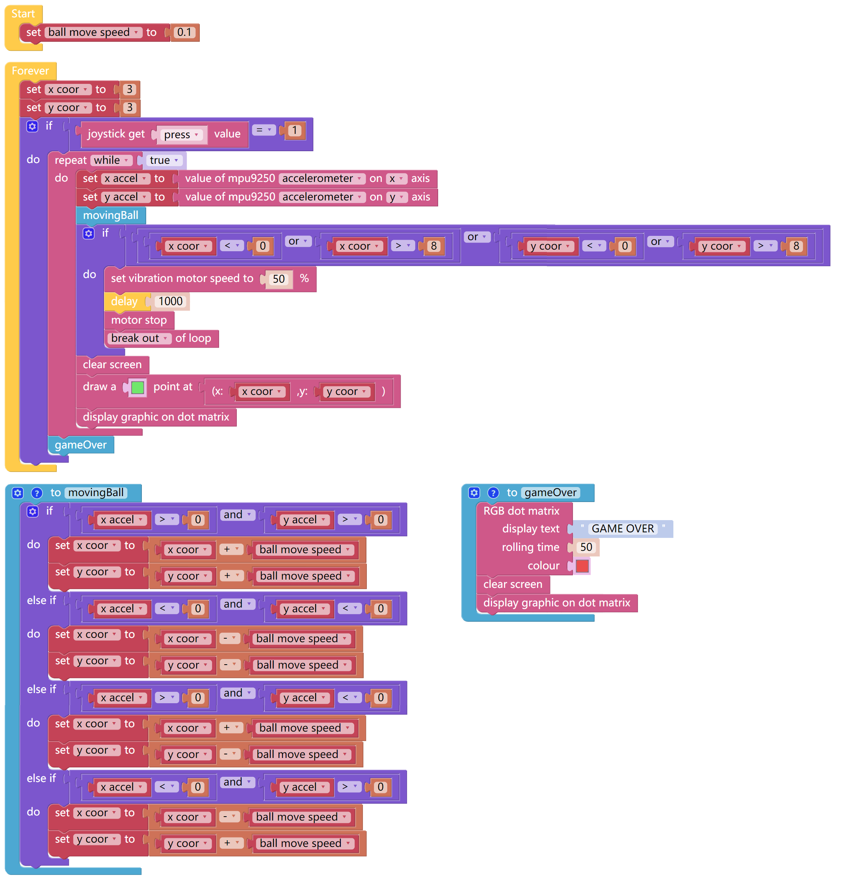

Gravity Ball Game
===================

Next, we have a gravity ball game on X Sense HAT. After pressing the joystick, the game starts. You need to keep the ball in the middle, if the ball hits the edge, the game is over.

TIPS
-----

A repeating block, when the condition is true, the code in **do** is executed repeatedly.

Interrupt the most recent loop, but cannot exit the loop of the **Forever** statement.

Here, we also use **to do something** block to create a new funtion, but the block does not return any value.

EXAMPLE
---------

.. note::
  You can find the full code on the Examples page of Ezblock Studio.

What's More
---------------

Our current code deals with the trajectory changes of the ball movement in the way of progressive coordinate values. 

If you want to simulate the real gravity sensing ball on the X Sense HAT, you can use the formula S = 1/2 * a * t ^ 2 
to calculatet the moving distance of the ball on different axes. For example, we read that the acceleration of the X Sense HAT on the x-axis is a1,
then at time t1, the X Sense HAT shifts S1 (1/2 * a1 * t1 ^ 2) on the x-axis and S2 (1/2 * a2 * t1 ^ 2) on the Y axis. 
If the original coordinates of the ball are (x1, y1), then after t1 time, its coordinates will change to (X1 + S1, y1 + S2).

You can try to write this code to make this experiment more interesting by changing the acceleration of the ball.

