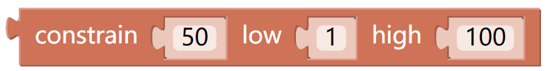
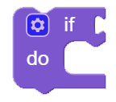
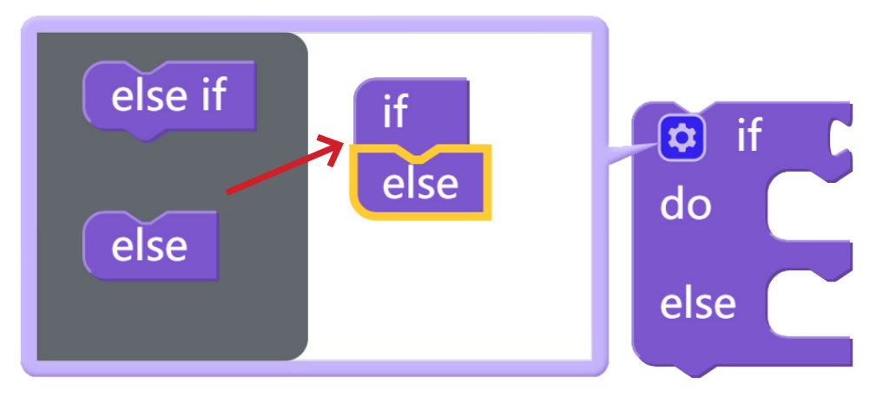
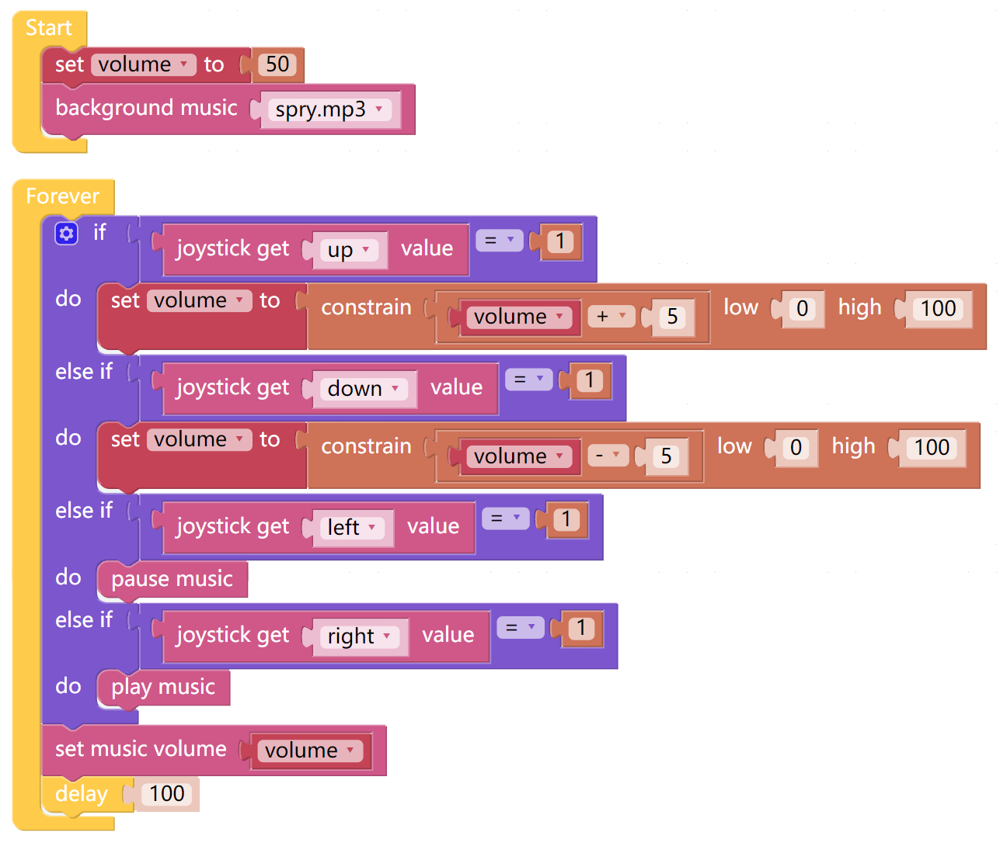

Music Player
=============

In this example, the X Sense HAT acts as a Music Player, the up and down buttons of the joystick to control the volume of the Music Player and the left and right buttons to control the pause or play of the music.

TIPS
-----

You can choose different background music in the block drop-down menu to let X Sense HAT play.

Adjust the volume in the range "0 ~ 100".

Use this block to limit the input parameters in a rang(from low() to high()).

To achieve conditional judgment of **if** type, you need to use an **if do** block.

When you need to implement multiple conditional judgments, you will have to change if do into if else do or else if do.

This can be achieved by clicking on the upper left corner setting icon.

EXAMPLE
---------

