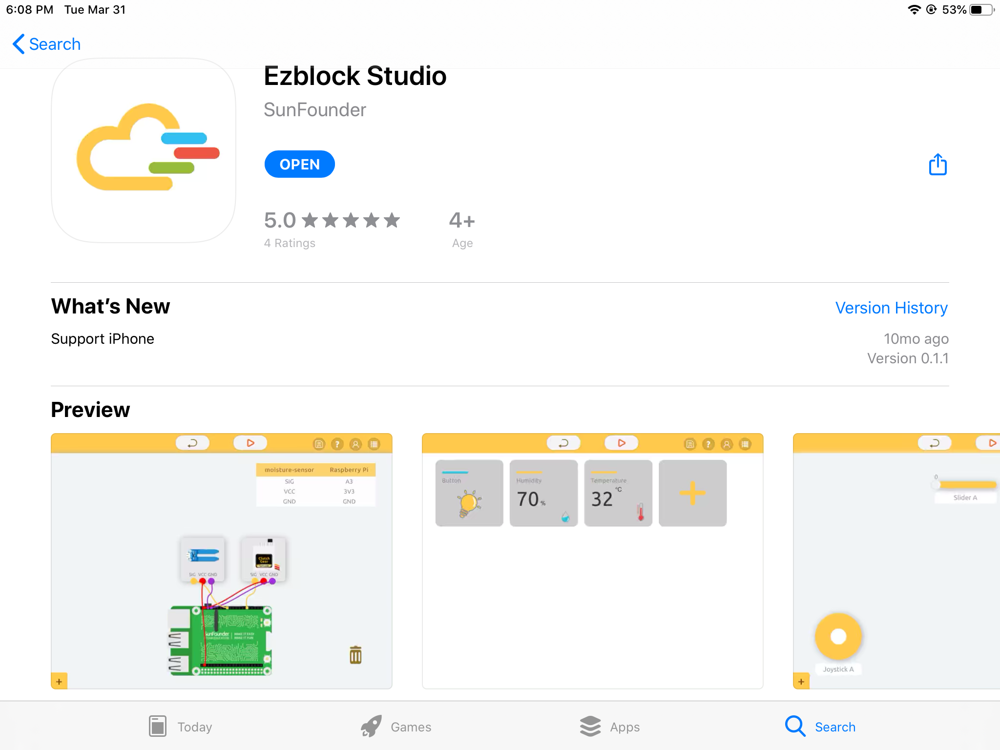

Play on Ezblock Studio
=========================

Introduce Ezblock Studio
-----------------------------

**Ezblock Studio** is a development platform developed by SunFounder designed for beginners to lower the barriers to getting started with Raspberry Pi. 
It has two programming languages: Graphical and Python, and available on almost all different types of devices.
With Bluetooth and Wi-Fi support, you can download code, remote control a Raspberry Pi, on Ezblock Studio.

Open App Store (iOS/Mac OS X system) or Play Store (Android/Windows/Linux system), then search and download Ezblock Studio.

Please get detailed tutorial of Ezblock Studio at: `Get Start with Ezblock Studio <https://docs.ezblock.cc/en/latest/>`_.

Programming
--------------

If you are a programming newbie, it is recommended to learn Block programming first. You can quickly program the X Sense HAT with a simple drag and drop.

When you have a sufficient understanding of X Sense HAT, or when you want to challenge your Python programming ability, you can choose Python programming.

.. toctree::
    :maxdepth: 1
  
    for_block_user
    for_python_user

