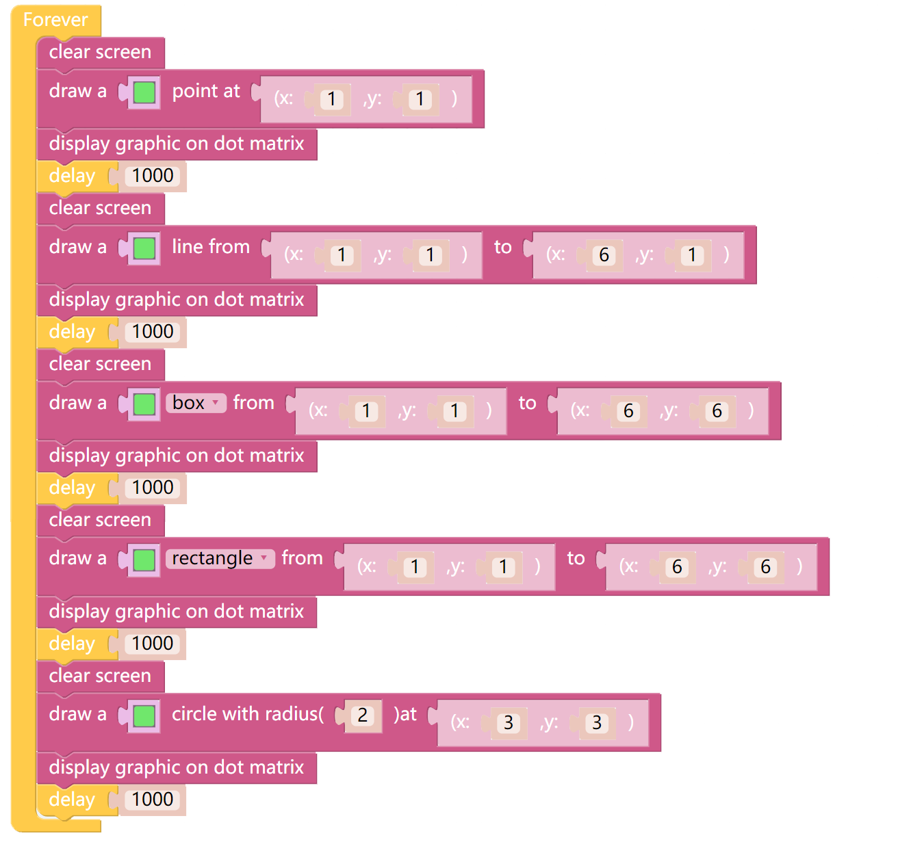

Point Line Rectangle Circle
=============================

By creating a coordinate we can draw a point, a line, a rectangle and a circle at the  specified location on the X Sense HAT.

TIPS
-----

The coordinate system of X Sense HAT takes the RGB LED at the bottom left corner as the coordinate origin (0,0) to establish the X axis and Y axis.
The coordinate of the lit red RGB light is (2,1).

.. image:: img/tip22.jpg
  :width: 350
  :align: center

You can use this block clear the content on the RGB dot matrix.

.. image:: img/tip23.png
  :width: 150
  :align: center

This block can draw a point on the specified coordinate.

.. image:: img/tip76.png
  :width: 450
  :align: center

This block can draw a line between 2 coordinates.

This block can draw a rectangle between 2 coordinates, where the first coordinate is the vertex of the lower left corner, and the second coordinate is the vertex of the upper right corner. Modify the drop-down options, you can choose rectangle or box.

This block can draw a circle with the specified coordinate as the center, you can enter the diameter of the circle in the first parameter.

Through this block, the drawn content can be displayed on the RGB dot matrix.

.. image:: img/tip28.png
  :width: 300
  :align: center

EXAMPLE
--------

