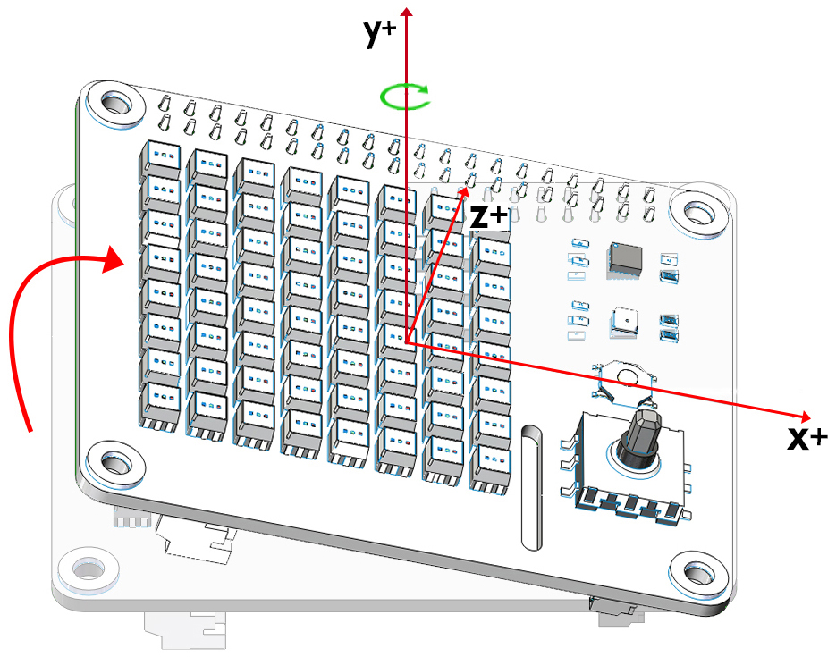
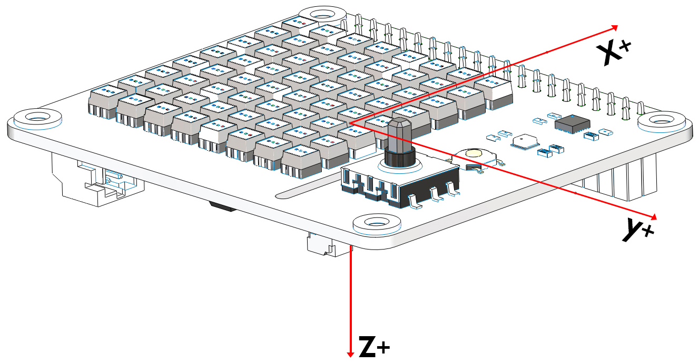
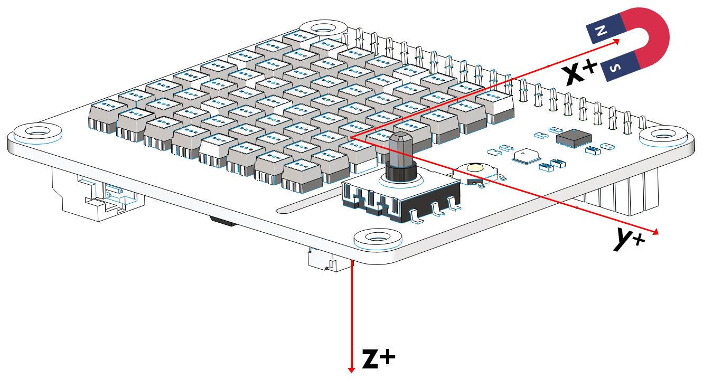

Python Programming
====================

Download the Code
-------------------

We can download the example codes by using git clone in the Raspberry Pi.

Change directory to /home/pi.

.. code-block:: python

    cd /home/pi/

.. note::
  cd, short for change directory is to change from the current path to the 
  intended directory. Informally, here is to go to the path /home/pi/.

Clone the repository from github.

.. code-block:: python

    git clone https://github.com/sunfounder/x-sense-hat.git

Stop Ezblock Service
-----------------------

The running of codes is based on Ezblock Studio. 
**Please stop Ezblock at first**.

.. code-block:: python

    sudo service ezblock stop

If you want to restart Ezblock, please run:

.. code-block:: python

    sudo service ezblock start

Ezblock is a startup program, and you can select the different commands to decide
whether the program runs at startup or not:

.. code-block:: python

    sudo service ezblock-reset stop

.. code-block:: python

    sudo service ezblock-reset start

Run the Codes
----------------------

Here we just show you the effect of this example implementation. You can go directly to the examples folder to see the full codes and run them.

The examples are from simple to complex and it is recommended to run them in order.

.. code-block:: python

    cd /home/pi/x-sense-hat/examples

You can run the python codes by the following command:

.. code-block:: python

    sudo python3 1.display_graphics.py 

1.display_graphics.py
^^^^^^^^^^^^^^^^^^^^^^^

Here we will draw a funny character and show a heart on the screen.

2.test_the_vibration_motor.py
^^^^^^^^^^^^^^^^^^^^^^^^^^^^^^^^

After running the code, the motor on the X Sense HAT will vibrate faster and faster.

3.display_temperature.py
^^^^^^^^^^^^^^^^^^^^^^^^^^^^

At this time the X Sense HAT is a thermometer to display the current temperature.

4.sound_effect.py
^^^^^^^^^^^^^^^^^^^^^

X Sense Hat can make voice. You can type text to make it speak, or make specific sound effects. 
Let us fire a gun as soon as a 3s countdown stops.

If you want to manually add some sound effects, you can upload your sound
effects to the path ``/home/pi/Sound/`` via FTP. Steps are:

1) Download desired sound effects to your PC and then download a FileZilla
software.

2) Start FileZilla then enter Host: 192.xxx.xx.xxx, Usename: xx, Password:
xxxxxxxx, Port: 22 and click Quickconnect. Copy the desired sound effects to 
``/home/pi/Sound/``.

3) Modify the function: ``sound_effect_play('Weapon_Continue_Shooting.wav',50)``
the sound effect file in this example.

5.music_player.py
^^^^^^^^^^^^^^^^^^^^

In this example, the X Sense HAT acts as a Music Player, the up and down buttons of the joystick to control the volume of the Music Player and the left and right buttons to control the pause or play of the music.

To add music, you can try to upload your music to the path ``/home/pi/Music/`` via
FTP. Rename the music file in the function ``background_music('spry.mp3')``.

6.point_line_rectangle_circle.py
^^^^^^^^^^^^^^^^^^^^^^^^^^^^^^^^^^^

By creating a coordinate we can draw a point, a line, a rectangle and a circle at the  specified location on the X Sense HAT.

7.calibrate_the_accelerometer_and_gyroscope.py
^^^^^^^^^^^^^^^^^^^^^^^^^^^^^^^^^^^^^^^^^^^^^^^^^

The InvenSense MPU9250 is a System in Package (SiP) that combines two chips: the MPU-6500 three-axis Accelerometer and three-axis Gyroscope; and the AK8963 three-axis Magnetometer. 

Before using the MPU9250 chip, we need to calibrate different chips.

After running the code, place the X Sense HAT horizontally. After 2 seconds, press the Joystick on the X Sense HAT to confirm, and then press ``Ctrl`` + ``C`` to exit the operation of the code, and the calibration is completed.

The X Sense HAT records the current horizontal position as a 0 degree point on the different axes of the Accelerometer and Gyroscope.

8.calibrate_the_magnetometer.py
^^^^^^^^^^^^^^^^^^^^^^^^^^^^^^^^^^^^

The figure below is the coordinate system that will be used to calibrate the magnetometer.

.. image:: img/tip34.jpg
  :width: 400
  :align: center

Download this code, Turn the B switch on（keep switch A off), rotate the X Sense HAT clockwise around the **y-axis** by 720° and then rotate it back (also 720°), please control the speed so that the process takes about 15s.

Similarly, rotate the X Sense HAT clockwise around the **x-axis** by 720° and then rotate it back (also 720°), please control the speed so that the process takes about 15s.

.. image:: img/tip36.jpg
  :width: 400
  :align: center

Finally, rotate the X Sense HAT clockwise around the **z-axis** by 720° and then rotate it back (also 720°), please control the speed so that the process takes about 15s.

.. image:: img/tip37.jpg
  :width: 400
  :align: center

Once calibration is complete, press the Joystick on the X Sense HAT to confirm. Then press ``Ctrl`` + ``C`` to exit the operation of the code.

9.read_from_mpu9250.py
^^^^^^^^^^^^^^^^^^^^^^^^^

After calibrating the MPU9250 chip, let's print the data read by the MPU9250 chip.

The following diagram shows the coordinate system for the Acelerometer and Gyroscope.

.. image:: img/tip41.png
  :width: 400
  :align: center

.. note::

  Note the positive direction on each axis.

**Accelerometer**

Through the Accelerometer, we can read the acceleration values of the X Sense HAT on the different axes in **g**.

Place the X Sense HAT horizontally. At this time, the X Sense HAT will be subjected to a vertical downward acceleration of gravity, which is **g (g=9.80665 N/kg)**.

.. image:: img/tip42.jpg
  :width: 400
  :align: center

When we print the acceleration value on the z-axis, the shell will display a value around -1. Since the acceleration value is on the negative semi-axis of the z-axis, the unit is negative.

.. code-block:: python

    def forever():
      while True:
        print("%s"%(imu.read("accel","z")))
        delay(100)

Rotate the X Sense HAT clockwise around the y-axis. At this time, the gravitational acceleration received by the X Sense HAT can be decomposed into an acceleration on the x-axis and
an acceleration on the z-axis, we can print these 2 accelerations on the shell.
        
.. code-block:: python

    def forever():
      while True:
        print("%s"%('-----------------'))
        print("%s"%(imu.read("accel","x")))
        print("%s"%(imu.read("accel","z")))
        delay(100)

**Gyroscope**

Through the Gyroscope, we can read the angular velocity values ​​of X Sense HAT on different coordinate axes, the unit size is degrees/second.

The judgment of the unit symbol follows the right-hand spiral rule. Hold the axis with your right hand and the thumb points in the direction of the positive semi-axis.

At this time, the direction pointed by the four fingers is the positive direction of the angular velocity value.

.. image:: img/tip64.jpg
  :width: 400
  :align: center

Print the angular velocity value on the y-axis.

.. code-block:: python

    def forever():
      while True:
        print("%s"%(imu.read("gyro","y")))
        delay(100)

Rotate the X Sense HAT clockwise around the y-axis. Because the angle of the X Sense HAT changes, the angular velocity value of the y-axis is generated and will be printed on shell.
According to the right-hand screw rule, its unit is positive.

  
**Magnetometer**
    
The following diagram shows the coordinate system for the Magnetometer.
  

.. note::

  Note the positive direction on each axis.

Through the magnetometer, we can read the magnetic field strength of X Sense HAT on different coordinate axes, the unit size is 15μT.

We can put a magnet on the positive x-axis of the X Sense HAT.

Then print the value of the magnetic field strength on the positive semi-axis of the x-axis (in positive unit).

.. code-block:: python

    def forever():
      while True:
        print("%s"%(imu.read("mag","x")))
        delay(100)

10.attitude_angle.py
^^^^^^^^^^^^^^^^^^^^^^^^

The X Sense HAT calculates the attitude angle of the current position so that we can know whether the X Sense HAT horizontal or not.

This is the coordinate system of the attitude angle.

The unit symbol of the attitude angle also follows the right-hand spiral rule. 

Hold the **x-axis** with your right hand and the thumb points in the direction of the positive semi-axis.
At this time, the direction pointed by the four fingers is the positive direction of the roll angle.
  
In the same way, hold the **y-axis** with your right hand and the thumb points in the direction of the positive semi-axis.
At this time, the direction pointed by the four fingers is the positive direction of the **pitch angle**.

.. image:: img/tip57.jpg
  :width: 500
  :align: center

After the code runs, and then place the X Sense HAT horizontally, 0 will be printed on the shell.

If you rotate the X Sense HAT 30 degrees clockwise around the **x-axis**, 30 will be printed on the shell.

.. image:: img/tip70.jpg
  :width: 400
  :align: center

Now change the variable **aram** to **pitch**, and then re-run the code.

.. code-block:: python

  def forever():
    while True:
      print("%s"%(imu.get_posture_angle(aram = "pitch")))
      delay(100)

Rotate the X Sense HAT 30 degrees counterclockwise around the **y-axis**, -30 will be printed on shell.

.. image:: img/tip69.jpg
  :width: 400
  :align: center

11.make_gif.py
^^^^^^^^^^^^^^^^

Draw multiple independent actions on the dot matrix screen. After the code runs, you can see a GIF animation.

12.spirit_level.py
^^^^^^^^^^^^^^^^^^^^

Make X Sense HAT a spirit level. By reading the changes in roll angle and pitch angle, we can know whether the X Sense HAT is level.

13.compass.py
^^^^^^^^^^^^^^^

We make X Sense HAT into a compass. Draw a circle on the RGB dot matrix, and then use the green dot to indicate the current direction, and the red dot to indicate the true north direction.

The green arrow indicates the detect direction of X Sense HAT, you can use it to judge the current position.

.. image:: img/tip71.png
  :width: 300
  :align: center
  
Azimuth Bearing refers to the number on the outer circle and the Azimuth is the angle from the north direction line to the target direction line in a clockwise direction.
For example, 0 degrees is the direction of true north, and 30 degrees is the direction of 30° east by north.

.. image:: img/tip47.png
  :width: 300
  :align: center
    
Quadrant Bearing divides the direction of the compass into eight equal parts. For example, the NE direction is between 22.5 degrees and 67.5 degrees.
And between 67.5 degrees and 112.5 degrees is the E direction.

.. image:: img/tip68.jpg
  :width: 360
  :align: center

14.smart_sensor_hat.py
^^^^^^^^^^^^^^^^^^^^^^^^

We integrate the functions of X Sense HAT into a menu interface, press and hold the arrow keys of the joystick to select different functions, and press the joystick to execute the current function.

15.bugs_jump.py
^^^^^^^^^^^^^^^^^^

This is a jumping obstacle game. Use the joystick to control the jumping action of the bug and avoid variable speed obstacles.

16.gluttonous_snake.py
^^^^^^^^^^^^^^^^^^^^^^^^^

This is a snake-eating game with a joystick. The rule is to eat as many green dots as possible within 20 seconds. If you eat yourself, the score will return to zero.

17.gravity_ball.py
^^^^^^^^^^^^^^^^^^^^^^

This is a game that relies on gravity sensing to control the cube to eat points. When the cube touches the boundary, points will be deducted. The more points eaten within the specified time, the higher the score.

18.pattern.py
^^^^^^^^^^^^^^^^

After running the code, an interesting pattern will be displayed on the RGB dot matrix screen.

