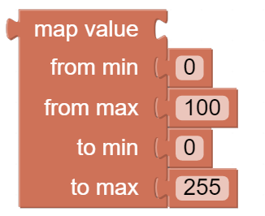
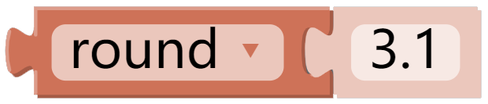
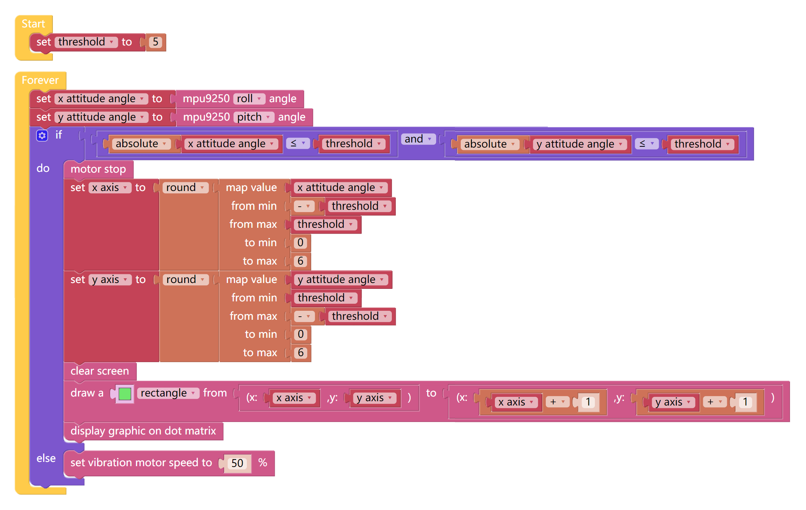

Spirit Level
==============

Make X Sense HAT a spirit level. By reading the changes in roll angle and pitch angle, we can know whether the X Sense HAT is level.

TIPS
------

The map block can remap a number from one range to another. If a number is 50，it is at 50% position
of the range of 0~100; then if we map it to the range 0~255 via the map block, the number will be 127.5.

  Logical expression - and. If both conditions are true, the result is true.

The **round** block can be used to round out the value after the decimal point. If the first decimal point is less than 5, it is directly discarded, and vice versa. For example, 1.25 will become 1 after rounding down.

EXAMPLE
---------

.. note::
  You can find the full code on the Examples page of Ezblock Studio.

