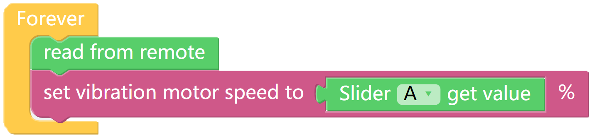

Test the Vibration Motor
===========================

We can use the slider in the **Bluetooth Control** page to control the frequency of the vibration motor on the X Sense HAT.

TIPS
------

To use the remote control function, you need to enter the Bluetooth Control page from the left side of Programming page.

Here we drag a Slider from the Controllers category, then return to the Programming page.

A new category-Remote containing the following block will appear on the Programming page. This block is used to get the value of the slider.

This block is used to adjust the vibration frequency of the vibration motor, the range is 0-100.

EXAMPLE
---------

